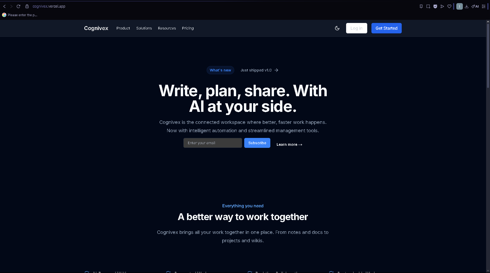
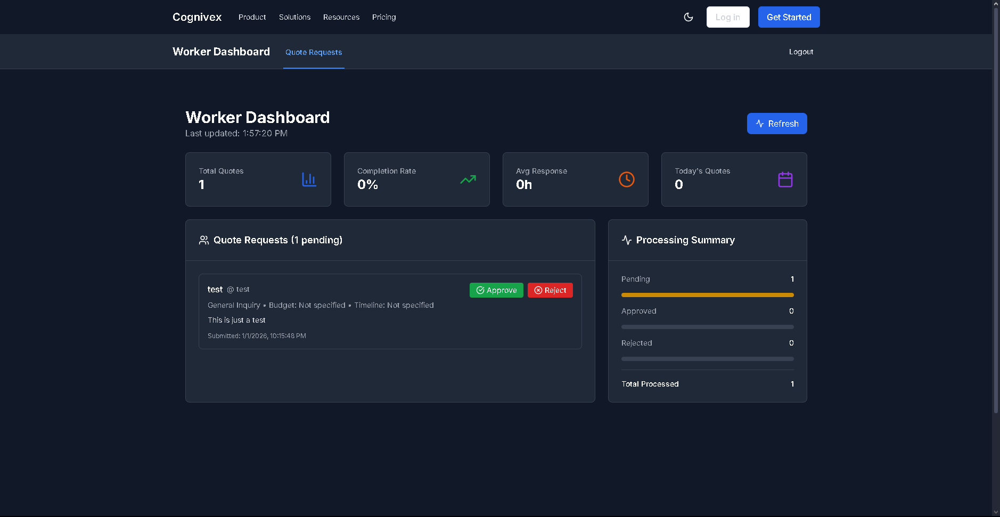
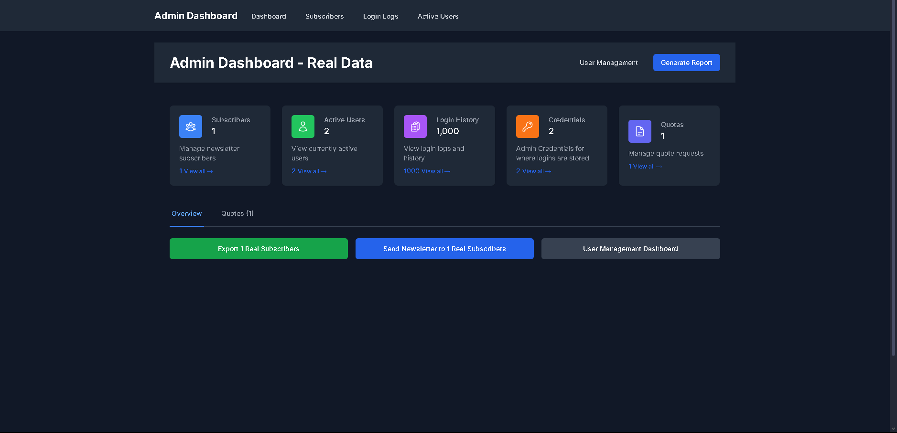

## Screenshots

### Main Dashboard


### Role-Based Views




---

# 4️⃣ **Cognivex** README  
📍 Repo: `cognivex`

```markdown
# Cognivex – Enterprise Admin Dashboard

A secure full-stack admin dashboard with authentication, role-based access control, and data visualization.

## 🚀 Live Demo
https://cognivex.vercel.app

**🚀 Live Admin & Worker Panels Available:**
- **Admin Panel**: `/admin/login` - Username: `test`, Password: `testtest`  
- **Worker Panel**: `/worker/login` - Username: `worker`, Password: `worker123`

## 📌 About
Cognivex is an enterprise-style dashboard built with Next.js App Router and TypeScript. The project focuses on secure routing, scalable API design, and reusable UI components.

**🚀 Live Admin & Worker Panels Available:**
- **Admin Panel**: `/admin/login` - Username: `test`, Password: `testtest`  
- **Worker Panel**: `/worker/login` - Username: `worker`, Password: `worker123`

## ⚙️ Key Features
- JWT authentication and role-based access
- Server-side rendering with Next.js
- MongoDB-backed data models

## 🛠 Tech Stack
**Frontend:** Next.js, TypeScript, Tailwind CSS  
**Backend:** Next.js API Routes  
**Database:** MongoDB

## 🧠 Challenges Solved
- Implemented RBAC across server and client
- Built reusable, type-safe UI components

## 🚀 Getting Started
```bash
git clone https://github.com/Turbo9k/cognivex.git
cd cognivex
npm install
npm run dev
